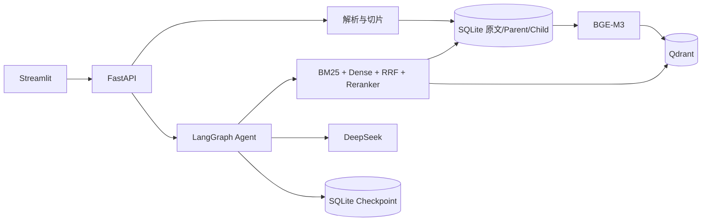

# 架构

```mermaid
flowchart LR
  U[Streamlit] --> API[FastAPI]
  API --> ING[解析与切片]
  ING --> DB[(SQLite 原文/Parent/Child)]
  DB --> EMB[BGE-M3]
  EMB --> Q[(Qdrant)]
  API --> AG[LangGraph Agent]
  AG --> RET[BM25 + Dense + RRF + Reranker]
  RET --> Q
  RET --> DB
  AG --> LLM[DeepSeek]
  AG --> CK[(SQLite Checkpoint)]
```

文档数据和 Embedding 模型解耦；Qdrant 通过别名 rag_active 指向当前版本的物理索引。Parent 用于补充上下文，Child 用于检索。PDF 页面和标题由结构化解析器提取，需人工抽样验证准确性。
